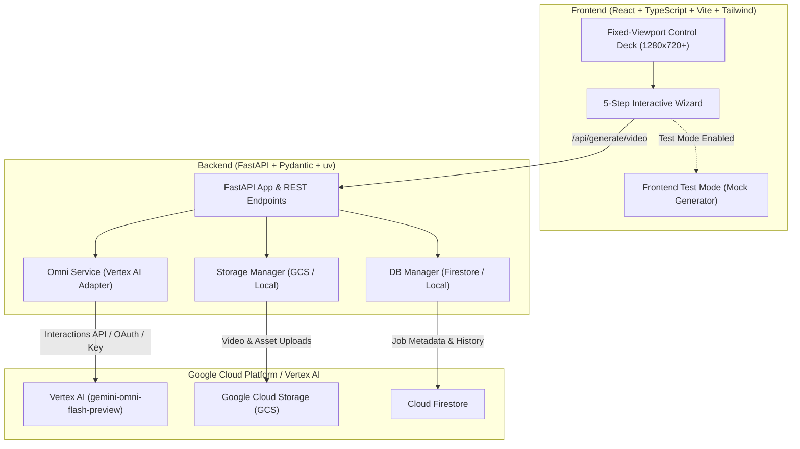
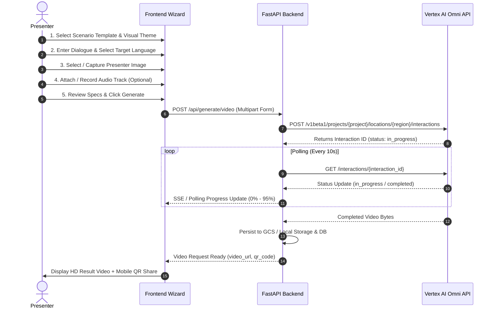

# Omni Portal — Executive Presentation & Architecture Overview

> **Gemini Omni Multimodal Video Generation Platform**  
> *Designed for Executive Demos & Production Deployments on Google Cloud Vertex AI*

---

## 🌟 Executive Summary

**The Omni Portal** is a high-impact, fixed-viewport control deck designed to demonstrate the state-of-the-art video generation capabilities of **Gemini Omni** on **Vertex AI**. 

Engineered for executive audiences and live presentations, the portal delivers a seamless, 5-step interactive wizard that guides presenters through creating cinematic, character-driven videos with natural multilingual dialogue and frame-accurate lip-sync.

### Key Capabilities at a Glance
* 🎬 **Cinematic Scenarios**: Curated high-production prompt templates spanning sci-fi, anime, claymation, and drama styles.
* 🗣️ **Multilingual Dialogue & Lip-Sync**: Native speech synthesis instructions across **10 languages** (English, Hindi, Tamil, Telugu, Kannada, Malayalam, Bengali, Marathi, Gujarati, Punjabi).
* 👤 **Character Persistence & Presenter Workbench**: Character-to-video generation using reference photos, webcam captures, or curated preset avatars.
* 🎵 **Audio Synchronization**: Multimodal video synthesis synchronized with uploaded audio, microphone recordings, or ambient music tracks.
* ⚡ **Vertex AI Integration**: Native REST & SDK integration with `gemini-omni-flash-preview` on Vertex AI with standard Application Default Credentials (ADC) or API keys.
* 🧪 **Zero-Cost Test Mode**: Instant frontend-local mock generation for offline smoke tests, local development, and confident live fallback.

---

## 📐 System Architecture

The application follows a clean decoupled full-stack architecture optimized for high performance, reliability, and casted presentation screens (1280x720 and higher).

---

## 🎨 Design Principles for Executive Demos

1. **Fixed-Viewport Deck (`1280x720+`)**: No page-level scrolling. Designed specifically for casted laptops, Chromebooks, and large conference room displays.
2. **High-Density Data Cards**: Premium card layouts with dark mode, glowing Google-accented borders, and semantic Tailwind tokens.
3. **Restrained Brand Accent**: Purposeful Google four-color gradient highlights on step indicators and the interactive **Generate** button.
4. **Clean Prompt Rendering**: Automatic stripping of internal structural tokens (e.g., `[REF_Character]`) in presenter-facing summaries.

---

## 🔄 5-Step Presentation Workflow

---

## 🛠️ Tech Stack Specifications

| Layer | Technology | Details |
| :--- | :--- | :--- |
| **Frontend Framework** | React 18 + TypeScript | Strict TS, Vite build tool, Lucide Icons, Shadcn UI components |
| **Frontend Styling** | Tailwind CSS v3 | Custom dark-mode theme, CSS tokens, Google color accents |
| **Backend Framework** | FastAPI (Python 3.11+) | Pydantic v2 settings, Async HTTPX client, Background tasks |
| **Package Management** | `uv` (Backend) & `npm` (Frontend) | Fast Python resolution with `pyproject.toml` & `uv.lock` |
| **AI Model** | Gemini Omni (`gemini-omni-flash-preview`) | Vertex AI Interactions API |
| **Storage Backends** | Google Cloud Storage / Local | Configurable via `STORAGE_BACKEND` env var |
| **Database Backends** | Cloud Firestore / Local In-Memory | Configurable via `DB_BACKEND` env var |
| **Deployment Target** | Cloud Run / Docker / Docker Compose | Serverless containerization with `--no-cpu-throttling` |

---

## 🚀 Presentation & Test Mode

To enable a risk-free live presentation without GCP backend setup or network latency:

1. Toggle **Test Mode** to `ON` in the sidebar panel.
2. Complete the wizard steps and click **Generate**.
3. The frontend immediately simulates live rendering progress and delivers a mock video result in seconds.

---

*For detailed deployment instructions and step-by-step guides, refer to the accompanying [README.md](README.md).*
