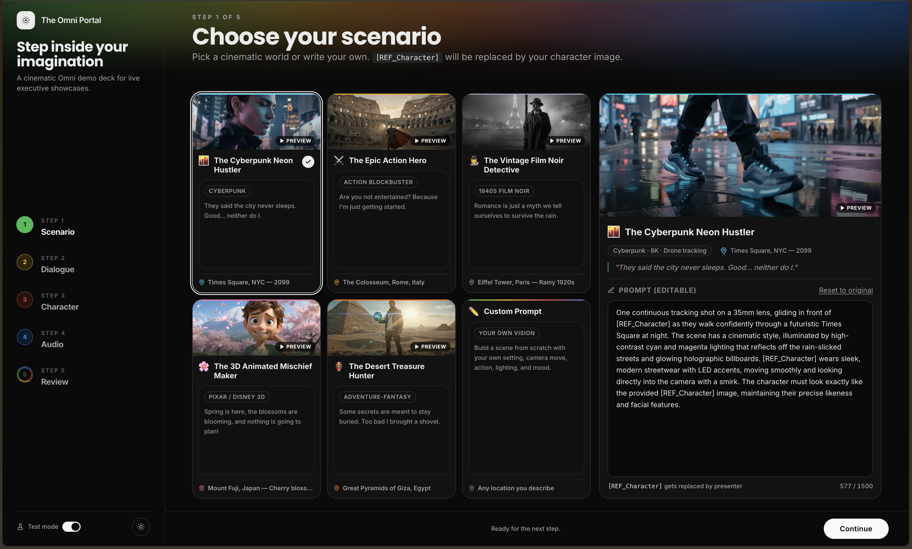
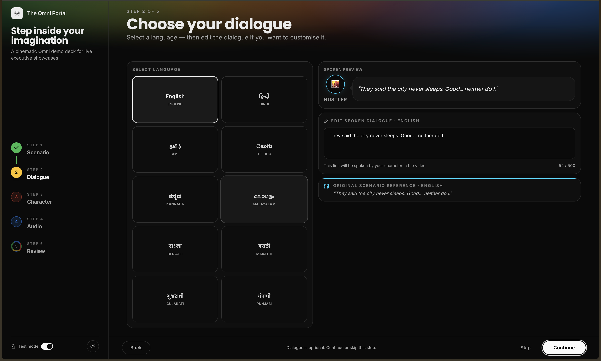
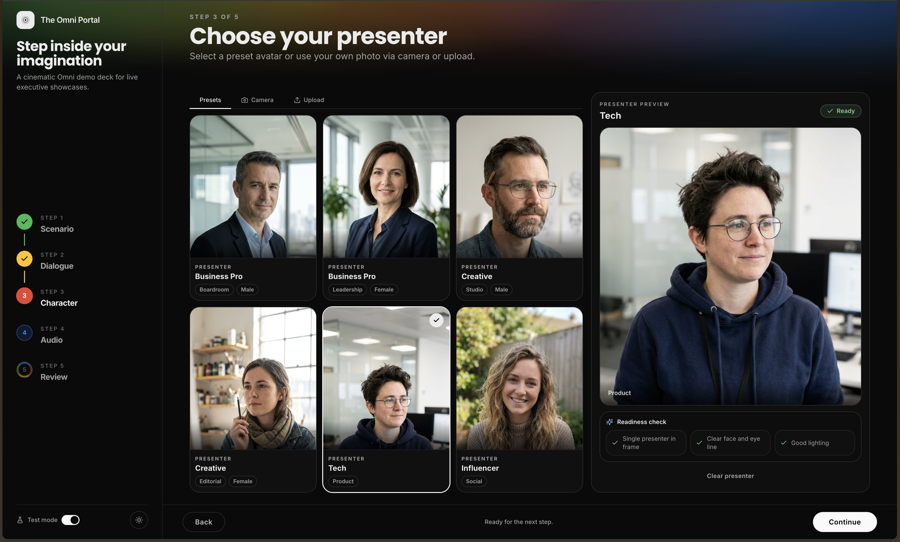
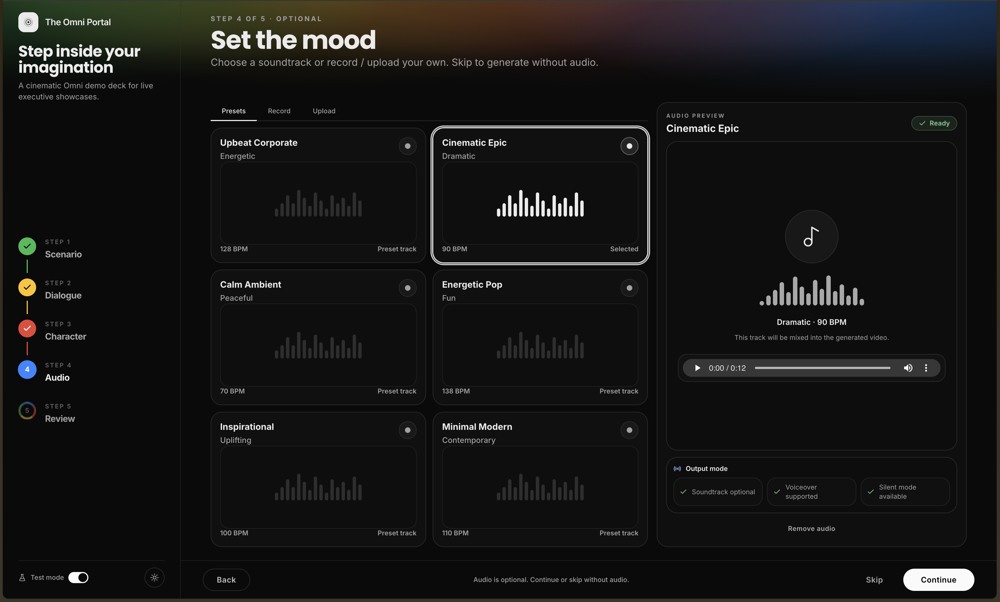
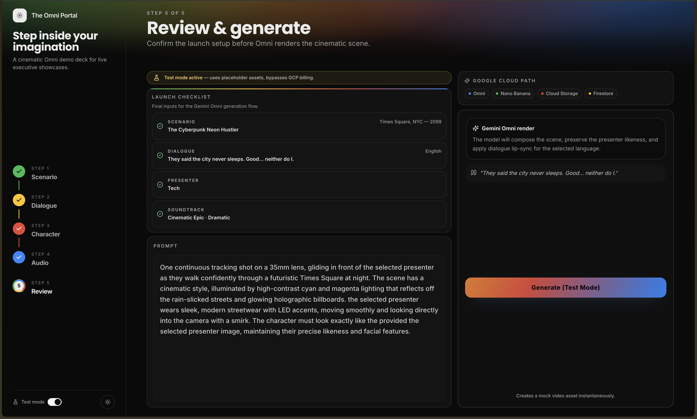
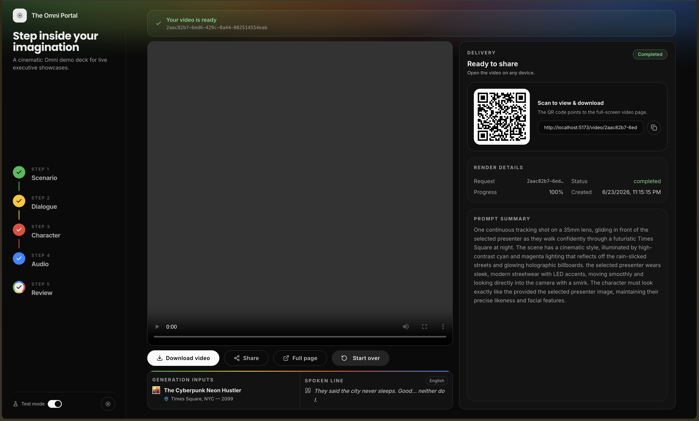

# The Omni Portal

A fixed-screen executive demo for **Gemini Omni** video generation. The app walks a presenter through a five-step flow: choose a cinematic scenario, choose dialogue/language, choose or capture a presenter, optionally add audio, then generate and share the finished video.

The current product target is **Google Marketing Live India**, shown on a large display to CxO-level attendees. The UI is intentionally a no-scroll, high-legibility control deck optimized for 1280x720 and larger casted screens.

## Current UI

### Step 1: Scenario Selection


### Step 1: Selected Scenario



### Step 2: Dialogue



### Step 3: Presenter



### Step 4: Audio



### Step 5: Review & Generate



### Result Delivery



## What Changed Recently

- Migrated the frontend from JavaScript/JSX to strict TypeScript/TSX.
- Added `frontend/tsconfig.json`, `frontend/src/lib/types.ts`, and typed config files: `vite.config.ts`, `tailwind.config.ts`, `postcss.config.ts`.
- Added `npm run typecheck`; `npm run build` now runs `tsc --noEmit` before Vite.
- Reworked the wizard into a fixed-viewport, no-scroll presentation layout.
- Improved Step 1, Step 3, Step 4, and Step 5 card density so large cards use their full area.
- Added frontend-local **Test Mode** generation, so local demos can complete without GCP calls.
- Added a polished result delivery screen with video, QR, copy link, render details, and prompt summary.
- Added `formatPromptForDisplay()` so internal `[REF_Character]` prompt tokens do not leak into user-facing prompt summaries.
- Made the Omni Portal brand button reset the wizard back to Step 1.
- Added an animated four-color Google border treatment on the Generate button hover/focus state.

## Features

- **Scenario templates** with cinematic prompts and local preview videos.
- **Presenter selection** via presets, camera capture, or uploaded portrait.
- **Multilingual dialogue** in English, Hindi, Tamil, Telugu, Kannada, Malayalam, Bengali, Marathi, Gujarati, and Punjabi.
- **Optional audio** via preset tracks, microphone recording, or upload.
- **Gemini Omni generation** through the FastAPI backend and Vertex Interactions API.
- **Shareable output** with generated video page, QR code, download, and copy-link actions.
- **Local Test Mode** that returns a mock completed video without hitting GCP.

## Project Structure

```text
omni_portal/
├── backend/
│   ├── app/
│   │   ├── main.py
│   │   ├── config.py
│   │   ├── api/routes/
│   │   ├── models/
│   │   └── services/
│   ├── tests/
│   ├── pyproject.toml
│   └── uv.lock
├── frontend/
│   ├── src/
│   │   ├── pages/
│   │   │   ├── Home.tsx
│   │   │   └── VideoView.tsx
│   │   ├── components/
│   │   │   ├── PromptSelector.tsx
│   │   │   ├── DialogueSelector.tsx
│   │   │   ├── CharacterSelector.tsx
│   │   │   ├── AudioSelector.tsx
│   │   │   ├── ReviewGenerate.tsx
│   │   │   ├── ResultPanel.tsx
│   │   │   └── ui/
│   │   └── lib/
│   │       ├── api.ts
│   │       ├── prompt.ts
│   │       ├── types.ts
│   │       └── utils.ts
│   ├── public/assets/
│   ├── tsconfig.json
│   ├── vite.config.ts
│   ├── tailwind.config.ts
│   └── postcss.config.ts
├── docs/
├── .agents/AGENTS.md
├── Makefile
└── README.md
```

## Quick Start

Install dependencies:

```bash
make install
```

Start backend and frontend together:

```bash
make start
```

Open [http://localhost:5173](http://localhost:5173).

For laptop/local demo runs, turn on **Test mode** in the left sidebar before generating. Test Mode uses frontend-local mock generation and avoids GCP/Omni calls.

## Development Commands

From the repo root:

```bash
make install       # backend uv sync + frontend npm install
make start         # backend + frontend concurrently
make start-be      # backend only
make start-fe      # frontend only
make lint
make format
make test
make check
```

Frontend-only checks:

```bash
cd frontend
npm run typecheck
npm run build
```

Backend-only checks:

```bash
cd backend
uv run pytest
```

## Local Real-GCP Mode

Use real mode only in an environment with the correct GCP project, bucket, Firestore setup, ADC credentials, and Gemini Omni access.

Key backend variables live in `backend/.env`:

```env
GCP_PROJECT_ID=your-project-id
GCP_LOCATION=us-central1
GCS_BUCKET_NAME=your-bucket-name
OMNI_MODEL=gemini-omni-flash-preview
OMNI_ENVIRONMENT=autopush
OMNI_REGION=global
STORAGE_BACKEND=gcs
DB_BACKEND=firestore
TEST_MODE=false
FRONTEND_URL=http://localhost:5173
```

Local laptop guidance: do not place production GCP secrets in this repo. Use **Test mode** for smoke tests unless a real demo backend is intentionally configured.

## Design Rules

- Fixed viewport, no page-level scrolling in the wizard.
- Target 1280x720 and larger display surfaces.
- Large typography, touch-friendly controls, and dense-but-readable card interiors.
- Use Google Sans stacks and semantic Tailwind tokens.
- Use Google colors as purposeful accents, not generic chrome.
- Keep the top AI gradient and Google-color treatments restrained.
- Do not show internal `[REF_Character]` tokens in user-facing UI; use `formatPromptForDisplay()`.

## Docs

- [System Workflow & Architecture](docs/0-workflow.md)
- [Backend Optimization & Hardening](docs/1-backend-optimizations.md)
- [Frontend Redesign & TypeScript Migration](docs/2-frontend-redesign.md)
- [Backend UI Realignment](docs/3-ui-backend-realignment.md)
- [Current Demo State](docs/4-current-demo-state.md)

## Screenshots

Screenshots used in docs live under [docs/assets/screenshots](docs/assets/screenshots).
