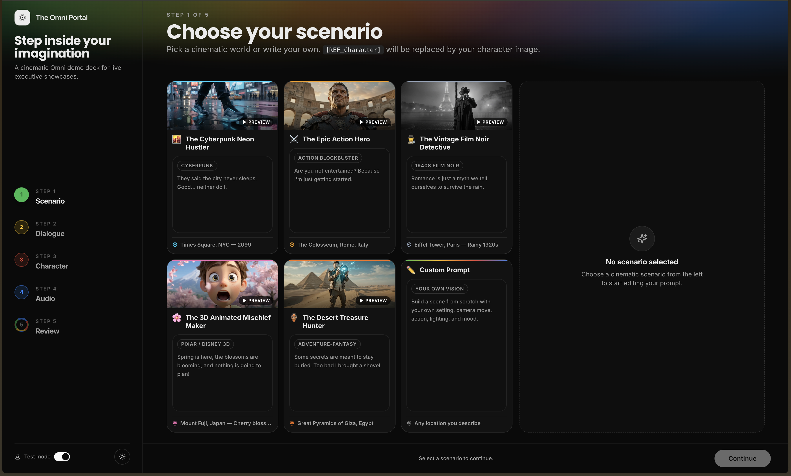

# The Omni Portal

**A wizard-driven web app for generating short cinematic videos with Google's `gemini-omni-flash-preview` on the Gemini Enterprise Agent Platform.** Type a name, pick a product, write a line of dialogue, choose a presenter and a scenario — get an HD video back with a QR code you can scan from your phone.

[](https://cloud.google.com/products/gemini)
[](https://fastapi.tiangolo.com)
[](https://react.dev)
[](https://www.typescriptlang.org)
[](https://www.python.org)
[](LICENSE)



> **Model:** `gemini-omni-flash-preview` is a public preview model on the Gemini Enterprise Agent Platform (formerly Vertex AI). Enable the platform's API on your GCP project and you're ready to go. No GCP access? Flip **Test Mode** in the sidebar to walk through the full wizard against a mocked backend — no credentials required.

---

## Contents

- [What it does](#what-it-does)
- [Try it in 30 seconds (Test Mode)](#try-it-in-30-seconds-test-mode)
- [Local development](#local-development)
- [Gemini Enterprise Agent Platform setup](#gemini-enterprise-agent-platform-setup)
- [Production deployment](#production-deployment)
- [Architecture](#architecture)
- [Project structure](#project-structure)
- [Environment variables](#environment-variables)
- [Make targets](#make-targets)
- [License & credits](#license--credits)

---

## What it does

The Omni Portal is a fixed-viewport, 6-step control deck that takes a user through the inputs Gemini Omni needs and produces a shareable HD video.

| Step | Screen | What it captures |
| :--- | :--- | :--- |
| 1 | **Character name** | The director-facing handle woven into later prompts. |
| 2 | **Hero product** | One of five product presets; its visual description flows into the scene prompt. |
| 3 | **Dialogue (optional)** | A line of speech in one of 10 languages. Gemini Omni handles lip-sync. |
| 4 | **Presenter** | Preset avatar, uploaded portrait, or live webcam capture — the character reference the model conditions on. |
| 5 | **Scenario** | One of five cinematic templates (Bollywood Romance, Cyberpunk Bengaluru, Monsoon Drama, Mythology Fusion, Pixar Style) or a fully custom prompt. |
| 6 | **Review & generate** | Final spec, then a single **Generate** button. |

**Languages supported for dialogue & lip-sync:** English, Hindi, Tamil, Telugu, Kannada, Malayalam, Bengali, Marathi, Gujarati, Punjabi.

### Walkthrough

Steps 1–2 (Name and Hero Product) are compact text/preset pickers. Screenshots below cover the steps with the most visual density.

**Step 3 — Dialogue**

Type the line and pick a language. Gemini Omni handles synthesis and lip-sync at generation time.


**Step 4 — Presenter**

Pick a preset avatar, upload a portrait, or capture a photo from the webcam.


**Step 5 — Scenario**

Browse the scenario cards, then confirm your pick to lock in the visual style.


**Step 6 — Review & Generate**

Final spec sheet, then a single click to launch generation.


### Result

Once generation finishes, the result screen delivers the MP4 with a download link, a share link, and a mobile-scannable QR code.


---

## Try it in 30 seconds (Test Mode)

Zero GCP setup required — Test Mode mocks the backend response with a sample video so you can exercise the whole UI.

```bash
make install    # backend (uv) + frontend (npm)
make start      # runs FastAPI on :8000 and Vite on :5173
```

Open [http://localhost:5173](http://localhost:5173), flip the **Test Mode** switch in the sidebar (or set `TEST_MODE=true` in `backend/.env`), and walk through the wizard.

**Prerequisites:** Node.js 18+, Python 3.12+, and [`uv`](https://docs.astral.sh/uv/getting-started/installation/).

---

## Local development

For real Gemini Omni generation you'll also need the [Google Cloud SDK](https://cloud.google.com/sdk/docs/install).

### 1. Install

```bash
make install
```

### 2. Configure

```bash
cp backend/.env.example backend/.env
```

Fill in your GCP settings. The `.env.example` file documents every variable — the minimum you'll want to change:

```env
GCP_PROJECT_ID=your-gcp-project-id
GCP_LOCATION=us-central1
GCS_BUCKET_NAME=your-gcs-bucket-name

# Keep local for offline dev; switch to gcs/firestore for shared/prod runs
STORAGE_BACKEND=local
DB_BACKEND=local

# Skip the Gemini Enterprise Agent Platform entirely
TEST_MODE=false
```

### 3. Run

```bash
make start          # both servers
make start-be       # backend only (uvicorn on :8000)
make start-fe       # frontend only (Vite on :5173)
```

Vite proxies `/api` and `/storage` to the backend, so the frontend origin (`localhost:5173`) is all you need in the browser.

---

## Gemini Enterprise Agent Platform setup

### 1. Enable the required Google Cloud APIs

```bash
gcloud services enable \
  aiplatform.googleapis.com \
  storage.googleapis.com \
  firestore.googleapis.com \
  --project=YOUR_PROJECT_ID
```

### 2. Authenticate

**Option A — Application Default Credentials (recommended for local dev):**

```bash
gcloud auth application-default login
```

**Option B — API key:** set `GEMINI_API_KEY=AIzaSy…` in `backend/.env`.

That's it — with either credential in place and `TEST_MODE=false`, the backend will call the real Gemini Enterprise Agent Platform Interactions API.

---

## Production deployment

<details>
<summary><b>Cloud Run (backend) + Firebase Hosting (frontend) — recommended</b></summary>

Firebase Hosting gives you an HTTPS URL, which mobile browsers require to open scanned QR-code links.

**Deploy the backend to Cloud Run:**

```bash
export GCP_PROJECT_ID="your-gcp-project-id"
export GCP_LOCATION="us-central1"
export GCS_BUCKET_NAME="your-gcs-bucket-name"

./deploy-cloud-run.sh
```

The script builds & pushes the container and deploys with `--no-cpu-throttling` + `--min-instances 1` so the 3–8 minute background generation task doesn't get killed while the response is already returned. A more robust design would move generation to Cloud Tasks / Pub/Sub — this deployment shape is sufficient for demos and low-traffic use.

**Deploy the frontend to Firebase Hosting:**

1. In [console.firebase.google.com](https://console.firebase.google.com/), add Firebase to your GCP project.
2. Run:
   ```bash
   export GCP_PROJECT_ID="your-gcp-project-id"
   ./deploy-firebase.sh
   ```

**Wire the backend to the frontend URL** so QR-code links resolve:

```bash
gcloud run services update omni-video-backend \
  --region us-central1 \
  --update-env-vars "FRONTEND_URL=https://your-gcp-project-id.web.app,ALLOWED_ORIGINS=https://your-gcp-project-id.web.app"
```

Every generated video now includes a QR code encoding `https://your-gcp-project-id.web.app/video/<request_id>`.

</details>

<details>
<summary><b>Docker Compose — one-command local/VM full stack</b></summary>

```bash
docker-compose up --build -d
```

- Frontend: [http://localhost:3000](http://localhost:3000)
- Backend: [http://localhost:8000](http://localhost:8000)

</details>

<details>
<summary><b>All-Cloud-Run — both services on Cloud Run</b></summary>

`./deploy-cloud-run.sh` deploys both the frontend and backend to Cloud Run and wires backend CORS and QR URLs to the frontend Cloud Run URL. Simpler than Firebase Hosting, but note that mobile-scannable QR codes still work only from HTTPS origins (Cloud Run URLs are HTTPS, so this is fine).

</details>

---

## Architecture

```
       ┌─────────────────────┐        ┌──────────────────────────┐
       │   Browser (Vite)    │        │  FastAPI (uvicorn)       │
       │   React 19 + TS 6   │  /api  │  Pydantic settings       │
       │   Shadcn + Tailwind │◄──────►│  BackgroundTasks queue   │
       └─────────────────────┘        └────────────┬─────────────┘
                                                   │
                              ┌────────────────────┼────────────────────┐
                              ▼                    ▼                    ▼
                    ┌──────────────────┐  ┌──────────────┐  ┌────────────────┐
                    │  Gemini Ent.     │  │  Cloud       │  │  Firestore     │
                    │  Interactions    │  │  Storage     │  │  (or local     │
                    │  (Gemini Omni)   │  │  (or local)  │  │   JSON store)  │
                    └──────────────────┘  └──────────────┘  └────────────────┘
```

- **Frontend** is a single-page app; the wizard state lives in `Home.tsx` and each step is a lazy-loaded component. Templates & character presets are static assets under `frontend/public/assets/`.
- **Backend** accepts a multipart POST to `/api/generate/video`, persists a request record, and kicks off generation in a FastAPI `BackgroundTask`. The client polls `/api/generate/status/<id>` until completion.
- **Storage and DB backends are pluggable** — set `STORAGE_BACKEND=local|gcs` and `DB_BACKEND=local|firestore`. The local backends use disk + a JSON file so the app works with zero cloud services.
- **Test Mode** short-circuits generation on the frontend and returns a canned sample video, so the whole UI is exercisable offline.

---

## Project structure

```text
omni_portal/
├── backend/
│   ├── app/
│   │   ├── main.py                    # FastAPI entrypoint, CORS, /health
│   │   ├── config.py                  # Pydantic settings (loads backend/.env)
│   │   ├── api/routes/                # /generate, /videos handlers
│   │   ├── models/                    # Pydantic request/response schemas
│   │   └── services/
│   │       ├── omni_service.py        # Gemini Enterprise Interactions API client
│   │       ├── storage_service.py     # GCS or local filesystem
│   │       ├── db_service.py          # Firestore or local JSON store
│   │       └── qr_service.py          # QR code generation for share links
│   ├── Dockerfile
│   ├── pyproject.toml                 # dependencies (uv)
│   └── uv.lock
├── frontend/
│   ├── src/
│   │   ├── pages/                     # Home (wizard), VideoView (share page)
│   │   ├── components/                # Step components + Shadcn/Radix UI
│   │   └── lib/                       # API client, prompt formatters, types
│   ├── public/assets/                 # Preset videos, character portraits
│   ├── Dockerfile                     # nginx production image
│   ├── nginx.conf
│   ├── tsconfig.json
│   └── vite.config.ts
├── docs/                              # Workflow & architecture docs
├── deploy-cloud-run.sh                # Cloud Run deployment
├── deploy-firebase.sh                 # Firebase Hosting deployment
├── docker-compose.yml
├── Makefile
└── README.md
```

---

## Environment variables

See [`backend/.env.example`](backend/.env.example) for the source of truth. Key variables:

| Variable | Description | Default |
| :--- | :--- | :--- |
| `GCP_PROJECT_ID` | Google Cloud project ID | `""` |
| `GCP_LOCATION` | Default GCP region | `us-central1` |
| `GCS_BUCKET_NAME` | Cloud Storage bucket for generated videos | `your-gcs-bucket-name` |
| `GEMINI_MODEL` | Gemini Enterprise Agent Platform model identifier | `gemini-omni-flash-preview` |
| `REGION` | Model interactions region (`global` recommended) | `global` |
| `GEMINI_API_KEY` | Optional API key (skip if using ADC) | `""` |
| `STORAGE_BACKEND` | `local` (disk) or `gcs` | `local` |
| `DB_BACKEND` | `local` (JSON) or `firestore` | `local` |
| `TEST_MODE` | Skip the platform call, return a canned sample video | `false` |
| `BASE_URL` | Backend URL, used to build QR/share links | `http://localhost:8000` |
| `FRONTEND_URL` | Frontend URL, encoded into QR codes | `http://localhost:5173` |
| `ALLOWED_ORIGINS` | Comma-separated CORS origins | `http://localhost:5173,http://localhost:3000` |

---

## Make targets

| Command | Action |
| :--- | :--- |
| `make install` | Install backend (`uv sync`) + frontend (`npm install`) |
| `make start` | Run both dev servers concurrently |
| `make start-be` | Backend only (uvicorn on `:8000`) |
| `make start-fe` | Frontend only (Vite on `:5173`) |
| `make lint` | Ruff (backend) + Biome (frontend) |
| `make format` | Ruff format + Biome format |
| `make check` | `format` → `lint` → `format` |
| `make clean` | Wipe build artifacts, caches, and virtualenvs |

---

## License & credits

Released under the [Apache License 2.0](LICENSE).

### Built by

[](https://www.linkedin.com/in/sunilkumar88/)
[](https://www.linkedin.com/in/vanshika-bansal-dataenthu/)
[](https://www.linkedin.com/in/adhish-thite/)

> A Gemini use-case demonstration. Not an official Google product.
