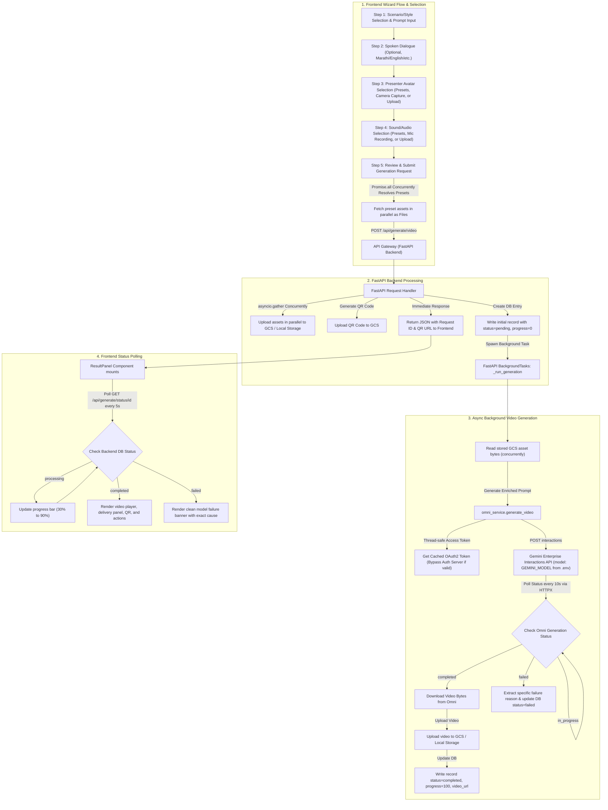

# System Workflow & Architecture Guide

This document outlines the end-to-end full-stack architecture, user selection flows, backend processing steps, and integration sequences for **The Omni Portal**.

---

## Current Implementation Notes

- Frontend is **React + Vite + strict TypeScript**. Source files under `frontend/src` are `.ts` / `.tsx`.
- The wizard shell is a fixed-viewport, no-scroll control deck for 1280x720+ casted screens.
- Local demo generation should use frontend **Test Mode** in the side rail. Test Mode creates a mock completed request without calling GCP.
- Preset prompts can contain the internal `[REF_Character]` token, but UI prompt summaries must render through `formatPromptForDisplay()` so the token does not appear to users.
- The Omni Portal brand control in the side rail resets the wizard back to Step 1.

---

## 1. Full-Stack Architecture & User Selection Flow

This diagram illustrates the step-by-step wizard flow in the React frontend, how the selections are packed and dispatched, and how the FastAPI backend orchestrates parallel file transfers, background tasks, and Gemini Enterprise Agent Platform model interactions.

---

## 2. Detailed Full-Stack Integration Sequence

This sequence diagram details the exact order of API calls, background processing operations, database writes, and thread-offloading points during the lifecycle of a video generation request.

```mermaid
sequenceDiagram
    autonumber
    actor User
    participant FE as Frontend (Vite/React)
    participant BE as FastAPI Backend
    participant Storage as GCS/Local Storage
    participant Auth as Google OAuth Cache
    participant Vertex as Gemini Enterprise Omni API

    User->>FE: Fills wizard & clicks "Generate"
    activate FE
    rect rgb(34, 34, 34)
        Note over FE: Resolves presets in parallel (Promise.all)
    end
    FE->>BE: POST /api/generate/video (Multipart Form-Data)
    activate BE
    
    rect rgb(34, 34, 34)
        Note over BE: Uploads images, audio, video in parallel (asyncio.gather)
    end
    BE->>Storage: upload_bytes() (Parallel Uploads)
    Storage-->>BE: Returns public URLs & local paths
    
    BE->>Storage: upload_bytes(qr_code.png)
    Storage-->>BE: Returns QR Code URL
    
    BE->>BE: db_service.create_request() (status=pending, progress=0)
    
    BE->>BE: Spawn Background Task (_run_generation)
    BE-->>FE: Response (200 OK): Request ID, QR Code URL, video_page_url
    deactivate BE
    
    FE->>FE: Mounts ResultPanel (progress=30%)
    
    loop Every 5 seconds
        FE->>BE: GET /api/generate/status/request_id
        BE-->>FE: Return current record (status & progress)
    end
    
    activate BE
    rect rgb(20, 20, 20)
        Note over BE: Background Task Execution
        BE->>Storage: read_bytes() (Read GCS asset bytes)
        Storage-->>BE: Return file bytes
        BE->>Auth: _get_cached_token()
        Auth-->>BE: Return cached access token (no auth server delay)
        BE->>Vertex: POST /locations/global/interactions (Prompt + Media Inputs)
        Vertex-->>BE: Return Interaction ID & status=in_progress
        
        loop Every 10 seconds
            BE->>Vertex: GET /locations/global/interactions/id (Thread-offloaded)
            Vertex-->>BE: Return status (in_progress / completed / failed)
        end
        
        alt Generation Succeeded
            Vertex-->>BE: Return completed status & video payload
            BE->>BE: _extract_video_bytes()
            BE->>Storage: upload_bytes(generated_video.mp4)
            Storage-->>BE: Return GCS video URL
            BE->>BE: db_service.update_request() (status=completed, progress=100)
        else Generation Failed
            Vertex-->>BE: Return failed status & error payload
            BE->>BE: db_service.update_request() (status=failed, error=failure_reason)
        end
    end
    deactivate BE
    
    FE->>BE: GET /api/generate/status/request_id (Final status)
    BE-->>FE: Return completed status & video_url
    FE->>User: Renders Video Player / Error Banner
    deactivate FE
```

---

## 3. Core Architectural Highlights

### 🚀 Parallel Execution (Waterfalls Eliminated)
* **Frontend**: Preset character images and audio files are resolved and fetched concurrently using `Promise.all` before dispatching the creation request.
* **Backend**: Image uploads, presenter avatars, dialogue audio tracks, and source video guides are uploaded to GCS concurrently using `asyncio.gather` in the API endpoint.

### 🧵 Thread-Offloaded Non-Blocking Event Loop
* Synchronous, blocking network operations from the Google Cloud Storage client (`upload_from_string`, `download_as_bytes`) and Gemini Enterprise Agent Platform SDK (`generate_videos`, `operations.get`) are offloaded to background threads using `asyncio.to_thread`.
* This preserves the FastAPI event loop, allowing the server to handle concurrent frontend requests without freezing.

### 🛡️ Thread-Safe Access Token Caching
* The backend caches the Google Cloud OAuth2 access token and its expiration timestamp. 
* Multiple concurrent background tasks use a shared async lock (`asyncio.Lock`) to prevent redundant authentication queries. Access tokens are reused until within 5 minutes of expiration, eliminating API network latency.

### 📊 Clean Error Reporting
* If the generation fails at the model layer (progress 30%), the polling task captures the failed state, extracts the specific model-level reason (e.g., HTTP 500, content safety block, or quota limits), and writes it to the request record for the frontend to render clearly.
